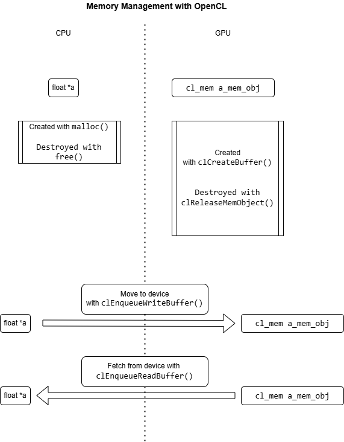
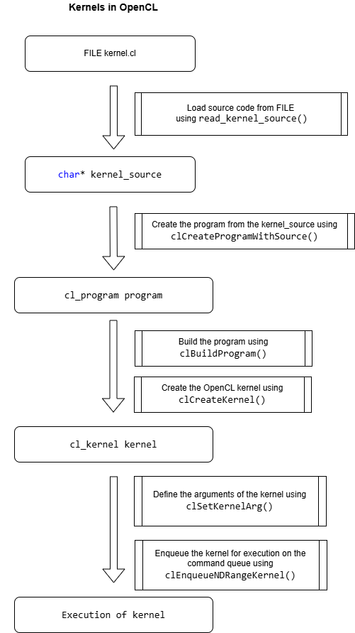

# OpenCL Vector Addition Demo

This is a simple OpenCL program that demonstrates parallel vector addition. The program adds two vectors `a` and `b` to produce vector `c`, where `c[i] = a[i] + b[i]` for all elements. For this demo, I'll be using the nvcc compiler.

## Files

- `vector_add.c` - Main C program that initializes OpenCL and manages the computation
- `vector_add.cl` - OpenCL kernel that performs the actual vector addition
- `Makefile` - Build configuration for easy compilation
- `README.md` - This file

## Compilation

To compile the program, simply run:
```bash
make
```

This will create an executable called `vector_add`.

## Running the Program

To run the program:
```bash
./vector_add
```

Or use the make target:
```bash
make run
```

## What the Program Does

1. **Initialization**: Sets up OpenCL platform, device, context, and command queue
2. **Data Setup**: Creates three vectors of 100 floating-point numbers each:
   - Vector `a`: contains values [0, 1, 2, ..., 99]
   - Vector `b`: contains values [0, 2, 4, ..., 198] (each element is 2× the index)
   - Vector `c`: initialized to zeros (will store the result)
3. **Kernel Execution**: Runs the OpenCL kernel in parallel to compute `c = a + b`
4. **Results**: Displays the first 10 results and the last result


## How does OpenCL work?

OpenCL works in a very similar way to CUDA. There is a distinction which should be maintained between
data stored on the host, and buffers used on the OpenCL device (i.e. GPU, for instance).


This divide is demonstrated in the figure below:



With regards to execution, the primary differences between CUDA and OpenCL can be summarized in the workflow:

* OpenCL command queues
* OpenCL kernels

### Command Queue

OpenCL explicitly creates command queues - these queues store a list of operations to be performed as part of the computation.

In this case, we are performing a simple vector add on the OpenCL device. This involves adding the following pieces of work onto the command queue:

1) Copying the two input arrays (a and b) from the host into the buffers stored on the device,
2) Executing the kernel for performing the vector addition (c = a + b)
3) Copying the output array buffer (c) from the device back to the host.

All of the above operations involve code using the term "clEnqueue" and provide the command queue as an input.

### OpenCL Kernel

The actual computation performed in the device is shown below:

```c
__kernel void vector_add(__global const float* a,
                        __global const float* b,
                        __global float* c,
                        const int n) {
    // Get the global ID of the current work item
    int gid = get_global_id(0);
    
    // Make sure we don't go out of bounds
    if (gid < n) {
        c[gid] = a[gid] + b[gid];
    }
} 
```

Which is very similar to a CUDA kernel, with the main differnce being that:

* In OpenCL, we identify each thread on the device using the get_global_id() function. Also, this function starts with the **__kernel** prefix.
* In CUDA, we identify each thread through its block ID and thread ID. A CUDA kernel often starts with the **\_\_global\_\_** prefix.

The primary difference is in how and when this code is built into something executed on the device. In CUDA, this happens at build time. However, in OpenCL, this code is compiled and built at the run time of the program.

The entire process of:

* Loading the source code for the kernel,
* Building it,
* Setting up its arguments, and
* Queueing it for work on a command queue

is shown in the diagram below:



## Expected Output

The program will output something like:
```
Vector Addition Results (showing first 10 elements):
c[0] = 0.00 + 0.00 = 0.00
c[1] = 1.00 + 2.00 = 3.00
c[2] = 2.00 + 4.00 = 6.00
c[3] = 3.00 + 6.00 = 9.00
c[4] = 4.00 + 8.00 = 12.00
c[5] = 5.00 + 10.00 = 15.00
c[6] = 6.00 + 12.00 = 18.00
c[7] = 7.00 + 14.00 = 21.00
c[8] = 8.00 + 16.00 = 24.00
c[9] = 9.00 + 18.00 = 27.00
...
c[99] = 99.00 + 198.00 = 297.00
Vector addition completed successfully!
```

## Cleaning Up

To remove compiled files:
```bash
make clean
```

## Troubleshooting

If you encounter compilation errors:
1. Make sure OpenCL development libraries are installed
2. Check that your system has OpenCL-compatible hardware (GPU or CPU)
3. Verify that the OpenCL runtime is properly installed

If you get runtime errors:
1. Ensure your GPU drivers are up to date
2. Check that OpenCL is supported on your hardware
3. Some systems may require additional OpenCL runtime packages 